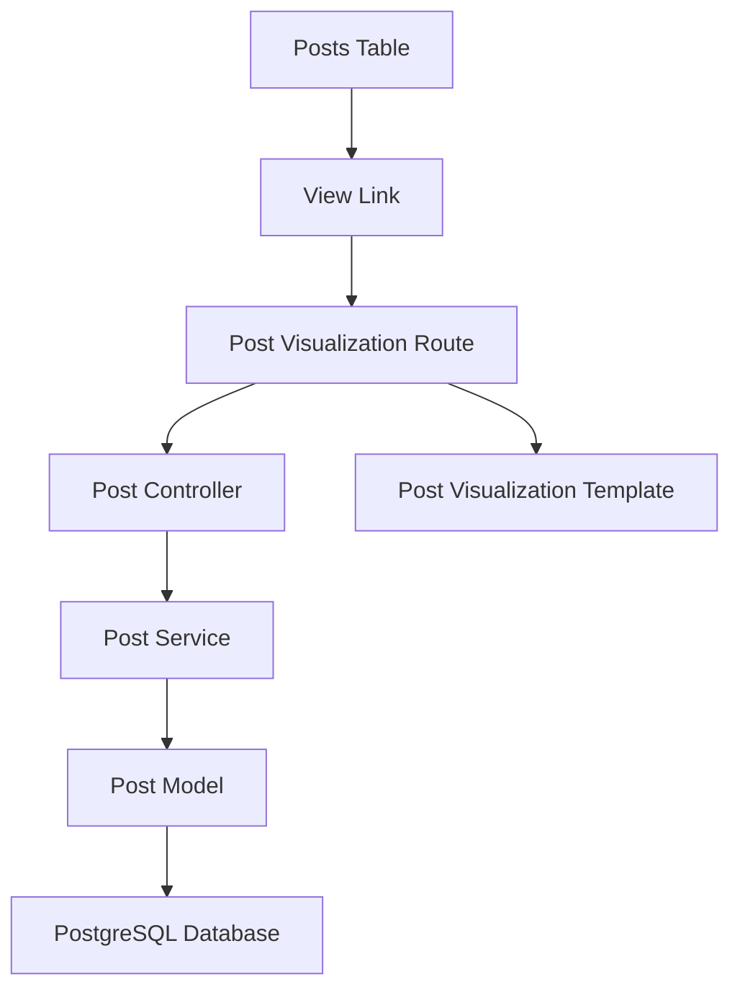
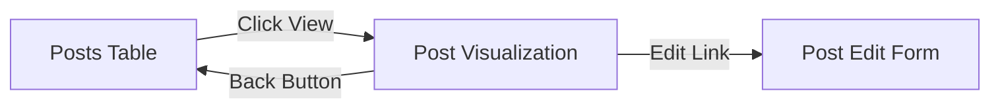

# Post Visualization Feature Design

## Overview

This feature adds a detailed visualization page for individual posts within the existing Flask-based social media management system. The feature will allow administrators to view comprehensive post information by clicking a link in the posts table, redirecting to a dedicated visualization page that displays all post data in a clean, organized format.

## Technology Stack & Dependencies

- **Backend Framework**: Flask with SQLAlchemy ORM
- **Frontend**: Server-side rendered HTML templates with Alpine.js
- **Styling**: Tailwind CSS (existing styling system)
- **Database**: PostgreSQL with existing post schema
- **Icons**: Lucide Icons (existing icon library)

## Architecture

### Component Integration
The post visualization feature integrates with the existing system architecture:



### Data Flow
1. User clicks "View" link in posts table
2. Browser navigates to `/adm/posts/{post_code}/view`
3. Controller retrieves post data via service layer
4. Template renders comprehensive post information
5. User sees detailed post visualization

## Component Architecture

### URL Structure
```
/adm/posts/{post_code}/view - Post visualization page
```

### Route Handler
New route in `src/controllers/adm/posts.py`:
- Method: GET
- Path: `/adm/posts/<string:post_code>/view`
- Returns: Rendered post visualization template

### Service Layer Integration
Extends existing `posts_service.py`:
- Function: `get_post_by_code(post_code)`
- Returns: Complete post object with related media
- Error handling: 404 if post not found

### Template Structure
New template `src/templates/adm/post_view.html`:
- Extends existing layout system
- Displays comprehensive post information
- Includes media attachments visualization
- Responsive design using Tailwind CSS

## Data Models & ORM Mapping

### Existing Post Model Usage
```
Post Fields Displayed:
- code: Primary identifier
- name: Post title
- status: Current status (draft, published, etc.)
- briefing: Short description
- copy: Full post content
- created_at: Creation timestamp
- scheduled_at: Scheduled publication time

PostMedia Fields Displayed:
- code: Media identifier
- name: Media file name
- key: S3 storage key
- created_at: Upload timestamp
- details: Additional media information
```

### Data Relationships
- One Post has many PostMedia items
- Media files referenced by S3 keys
- All timestamps displayed in Brazil timezone

## Post Visualization Layout

### Page Structure
```
┌─────────────────────────────────────┐
│ Header: Post Name + Back Button     │
├─────────────────────────────────────┤
│ Post Metadata Section               │
│ ├─ Status Badge                     │
│ ├─ Creation Date                    │
│ ├─ Scheduled Date                   │
│ └─ Post Code                        │
├─────────────────────────────────────┤
│ Content Section                     │
│ ├─ Briefing                         │
│ └─ Full Copy                        │
├─────────────────────────────────────┤
│ Media Attachments Section           │
│ ├─ Media Count                      │
│ └─ Media List with Details          │
└─────────────────────────────────────┘
```

### Information Display Sections

#### 1. Post Header
- Large post name/title
- Back to posts table button
- Edit post button (future enhancement)

#### 2. Metadata Grid
- **Status**: Color-coded status badge
- **Code**: Formatted post identifier
- **Created**: Formatted creation date/time
- **Scheduled**: Formatted schedule date/time (if applicable)

#### 3. Content Display
- **Briefing**: Displayed in highlighted box
- **Copy**: Full post content with proper text formatting
- **Character counts**: Display length statistics

#### 4. Media Attachments
- **Media count**: Total number of attachments
- **Media list**: Table showing each media file:
  - Media name
  - Upload date
  - File details
  - S3 key reference

## Navigation Integration

### Posts Table Enhancement
Modify existing `src/templates/adm/posts.html`:
- Add "View" link/button in each table row
- Link format: `/adm/posts/{post.code}/view`
- Use existing table styling patterns

### Navigation Flow


## Styling Strategy

### Design System Consistency
- Use existing Tailwind CSS classes
- Follow current dark theme (zinc color palette)
- Maintain consistent spacing and typography
- Responsive design for mobile/desktop

### Visual Hierarchy
- Large headings for sections
- Card-based layout for information groups
- Consistent spacing using Tailwind gap utilities
- Status badges with color coding

### Color Coding
- **Status badges**: 
  - Draft: Gray (bg-zinc-700)
  - Published: Green (bg-green-700)
  - Scheduled: Blue (bg-blue-700)
  - Archived: Red (bg-red-700)

## Error Handling

### Not Found Handling
- 404 error when post code doesn't exist
- Friendly error message with link back to posts table
- Proper HTTP status codes

### Permission Handling
- Integrate with existing admin authentication
- Redirect to login if not authenticated
- Consistent with existing admin area security

## Performance Considerations

### Database Queries
- Single query to fetch post with related media
- Eager loading of PostMedia relationships
- No N+1 query problems

### Template Rendering
- Server-side rendering for fast initial load
- Minimal JavaScript for interactive elements
- Cached media information display

## Testing Strategy

### Unit Tests
- Test post retrieval service function
- Test route handler logic
- Test template rendering with mock data

### Integration Tests
- Test complete navigation flow
- Test error handling scenarios
- Test with various post status types

### Manual Testing Scenarios
- Navigate from posts table to visualization
- View posts with different statuses
- View posts with/without media attachments
- Test responsive design on mobile
- Test back navigation functionality