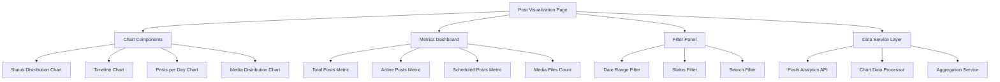
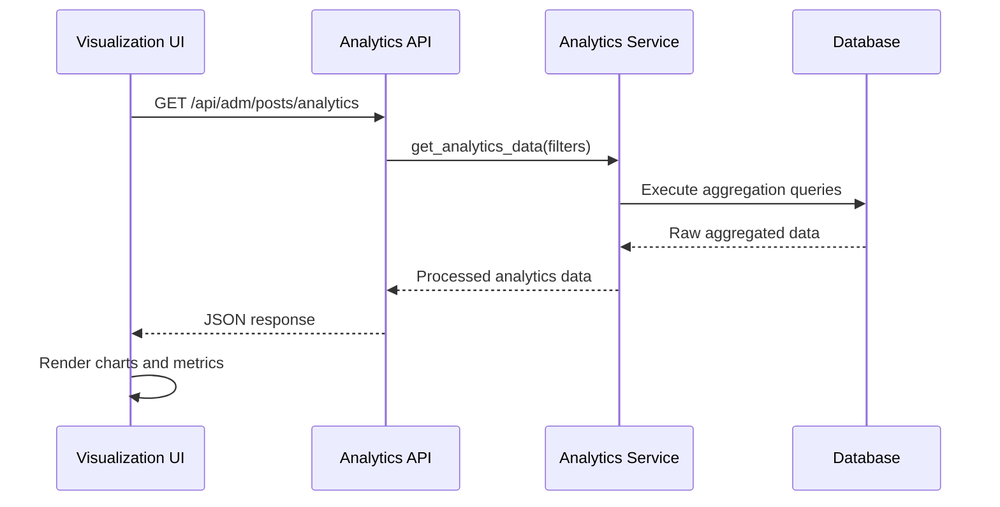

# Post Visualization Page Design

## Overview

This design document outlines the implementation of an enhanced post visualization page for the Flask-based social media management application. The page will provide interactive charts, analytics, and improved data visualization capabilities beyond the existing tabular post listing.

The visualization page will complement the existing `/adm/posts` endpoint by offering dashboard-style analytics with charts, metrics, and visual insights about post performance, status distribution, and temporal patterns.

## Architecture

### Component Structure



### Technology Integration

The visualization page will integrate with the existing Flask application structure:

- **Backend**: Extends existing Flask SQLAlchemy models and services
- **Frontend**: Uses Alpine.js (already in use) with Chart.js for visualizations
- **Styling**: Maintains consistency with existing Tailwind CSS design
- **API**: Extends current API structure with analytics endpoints

## API Endpoints Reference

### Analytics Data Endpoint

**Endpoint**: `GET /api/adm/posts/analytics`

**Request Parameters**:
```
{
  "date_from": "2024-01-01",     // Optional: Start date filter
  "date_to": "2024-12-31",       // Optional: End date filter
  "status": "published",         // Optional: Status filter
  "group_by": "day|week|month"   // Optional: Time grouping
}
```

**Response Schema**:
```json
{
  "metrics": {
    "total_posts": 156,
    "published_posts": 89,
    "draft_posts": 45,
    "scheduled_posts": 22,
    "total_media_files": 234
  },
  "status_distribution": [
    {"status": "published", "count": 89},
    {"status": "draft", "count": 45},
    {"status": "scheduled", "count": 22}
  ],
  "timeline_data": [
    {"date": "2024-01-01", "count": 5, "status": "published"},
    {"date": "2024-01-02", "count": 3, "status": "published"}
  ],
  "media_distribution": [
    {"media_count": 0, "posts": 45},
    {"media_count": 1, "posts": 67},
    {"media_count": 2, "posts": 34}
  ]
}
```

### Chart Data Endpoint

**Endpoint**: `GET /api/adm/posts/chart-data/{chart_type}`

**Supported Chart Types**:
- `status-pie`: Pie chart data for status distribution
- `timeline-line`: Line chart data for posts over time
- `media-bar`: Bar chart data for media distribution

**Authentication Requirements**: 
- Requires admin authentication (same as existing `/api/adm/posts`)
- Uses existing JWT authentication mechanism

## Data Models & Analytics Processing

### Extended Post Analytics Model

The existing `Post` model will be extended with analytics methods:

```python
class Post(db.Model):
    # ... existing fields ...
    
    @classmethod
    def get_analytics_data(cls, date_from=None, date_to=None, status=None):
        """
        Retrieve aggregated analytics data for posts
        """
        pass
    
    @classmethod
    def get_status_distribution(cls, date_from=None, date_to=None):
        """
        Get distribution of posts by status
        """
        pass
    
    @classmethod
    def get_timeline_data(cls, date_from=None, date_to=None, group_by='day'):
        """
        Get posts count grouped by time periods
        """
        pass
```

### Analytics Service Layer

New service `posts_analytics_service.py`:

```python
from sqlalchemy import func, case
from datetime import datetime, timedelta

class PostsAnalyticsService:
    
    def get_metrics_summary(self, filters):
        """
        Calculate key metrics: total, by status, media counts
        """
        pass
    
    def get_status_distribution(self, filters):
        """
        Return posts grouped by status with counts
        """
        pass
    
    def get_timeline_analytics(self, filters, group_by='day'):
        """
        Return time-series data for posts creation
        """
        pass
    
    def get_media_distribution(self, filters):
        """
        Return distribution of posts by media count
        """
        pass
```

## Component Architecture

### Visualization Dashboard Component

The main visualization component structure:

```javascript
function postVisualization() {
    return {
        // State Management
        loading: false,
        analytics: null,
        chartInstances: {},
        
        // Filter State
        filters: {
            date_from: '',
            date_to: '',
            status: '',
            group_by: 'day'
        },
        
        // Chart Configuration
        chartConfigs: {
            statusPie: {...},
            timeline: {...},
            mediaBar: {...}
        },
        
        // Methods
        async loadAnalytics() {},
        renderCharts() {},
        updateFilters() {},
        exportData() {}
    }
}
```

### Chart Components

#### Status Distribution Pie Chart
- **Library**: Chart.js with Pie chart type
- **Data Source**: `/api/adm/posts/chart-data/status-pie`
- **Features**: Interactive segments, legend, tooltips
- **Colors**: Consistent with existing design theme

#### Timeline Line Chart
- **Library**: Chart.js with Line chart type
- **Data Source**: `/api/adm/posts/chart-data/timeline-line`
- **Features**: Time-based X-axis, multiple datasets for status
- **Interactivity**: Zoom, pan, hover tooltips

#### Media Distribution Bar Chart
- **Library**: Chart.js with Bar chart type
- **Data Source**: `/api/adm/posts/chart-data/media-bar`
- **Features**: Horizontal bars, count labels

### Metrics Dashboard Component

Key performance indicators displayed as cards:

```html
<div class="metrics-grid">
    <div class="metric-card">
        <h3>Total Posts</h3>
        <span class="metric-value" x-text="analytics.metrics.total_posts"></span>
    </div>
    <!-- Additional metric cards -->
</div>
```

## Routing & Navigation

### Route Definition

**New Route**: `/adm/posts/visualization`

**Controller**: `posts_visualization_controller.py`

```python
@posts_bp.route('/adm/posts/visualization')
def visualization_page():
    return render_template('adm/posts_visualization.html')
```

### Navigation Integration

Add navigation link to existing admin menu:

```html
<nav class="admin-nav">
    <a href="/adm/posts">Posts List</a>
    <a href="/adm/posts/visualization">Posts Analytics</a>
</nav>
```

## Styling Strategy

### Design System Consistency

- **Colors**: Maintain existing zinc/dark theme
- **Typography**: Use existing font hierarchy
- **Spacing**: Follow current Tailwind spacing scale
- **Components**: Consistent with existing form elements and buttons

### Chart Theme Configuration

```javascript
const chartTheme = {
    backgroundColor: 'rgb(39, 39, 42)', // zinc-800
    textColor: 'rgb(212, 212, 216)',   // zinc-300
    gridColor: 'rgb(63, 63, 70)',      // zinc-700
    accentColors: [
        'rgb(59, 130, 246)',  // blue-500
        'rgb(16, 185, 129)',  // emerald-500
        'rgb(245, 101, 101)', // red-400
        'rgb(251, 191, 36)'   // amber-400
    ]
}
```

### Responsive Design

- **Desktop**: Full dashboard layout with side-by-side charts
- **Tablet**: Stacked chart layout, reduced margins
- **Mobile**: Single column, simplified metrics

## Data Flow Architecture

### Data Retrieval Flow



### Real-time Updates

- **Polling Strategy**: Refresh data every 5 minutes
- **Manual Refresh**: User-triggered refresh button
- **Filter Changes**: Immediate data reload on filter modification

### Caching Strategy

- **Server-side**: Cache analytics queries for 2 minutes
- **Client-side**: Cache chart data between filter changes


